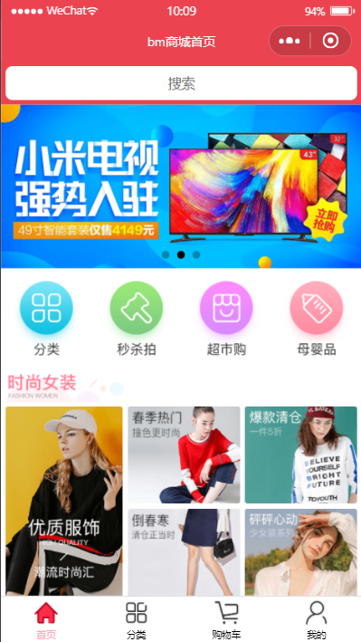
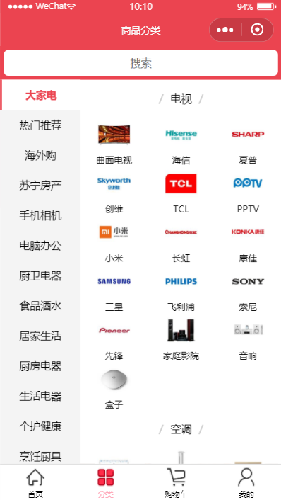
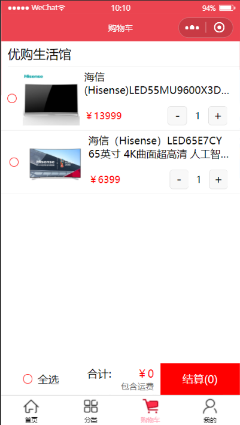
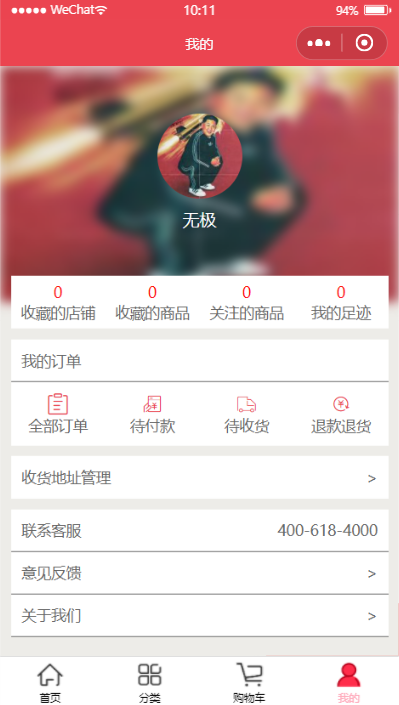
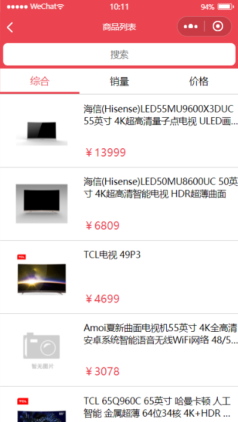
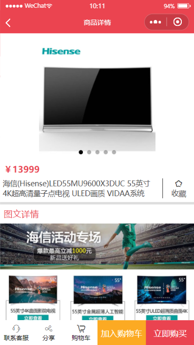

# 简介
使用uni-app框架开发的微信小程序，微信小程序编译版在dist/build下。<br/>
由于后台的功能限制，不支持H5和app端。<br>
可直接下载dist/build下的mp-weixin文件夹，导入到微信开发工具中查看。
## 安装及编译
```
npm install

npm run dev:mp-weixin

npm run build:mp-weixin
```

## 界面功能







